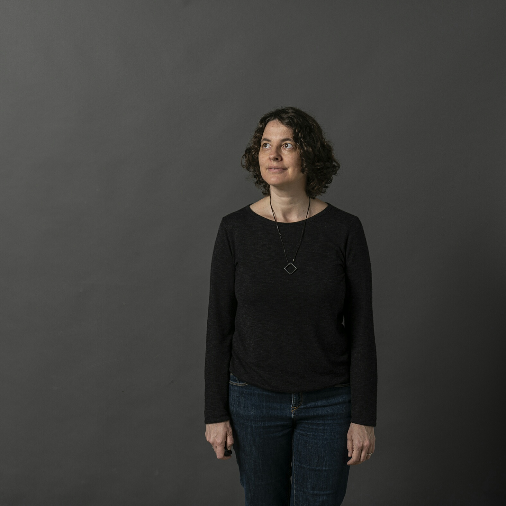

+++
date = 2020-11-05T12:12:33Z
title = "Homepage"
image-fit = "300x300" 
+++

 Marcia Cymbalista nasceu em São Paulo em 1972. É mestre em Artes Visuais pela ECA-USP. Cursou Artes Gráficas Livres na Universidade de Artes Aplicadas de Viena e é licenciada e bacharel em Educação Artística pela UNICAMP. Fez parte do Grupo de Estudo Sobre a Gráfica na ECA-USP.

Desde 2002 leciona desenho nos cursos de extensão da ECA-USP. É professora do curso livre de desenho para os alunos do ensino médio do Colégio São Domingos. A partir de 2016 passou a dar aulas de desenho e pintura e acompanhar a produção de artistas em seu ateliê — o “Ateliê Quatro Margens”. Orienta aulas abertas e outros cursos de curta duração em diversas unidades do SESC e outros espaços culturais como o IMS e o Centro de Arte da Casa do Artista. Foi professora de desenho e pintura no curso de artes plásticas da Faculdade Santa Marcelina por 14 anos e no ensino fundamental e médio dos Colégios Santa Cruz e Visconde de Porto Seguro.

Desenvolve trabalhos artísticos principalmente em desenho, gravura e pintura. Fez parte da Associação Jatobá. Participa de diversas exposições no Brasil e no exterior.
